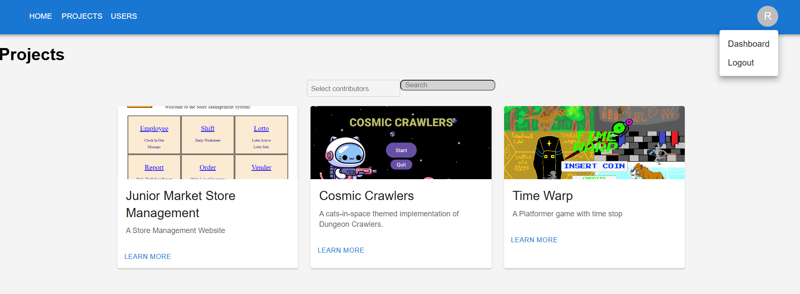

# GT Webdev Project Platform

This is a project showcase website for GT Webdev Club created using React.js for frontend, Node.js for backend, and MongoDB for database management worked on during Fall 2023 Semester.

## Features

- User Dashboard to add projects from Github
- Projects Showcase Page with search and filter bars to display all projects on the site
- Individual Project Pages that displays project information such as contributors, languages, and github link, as well as comments left by users.